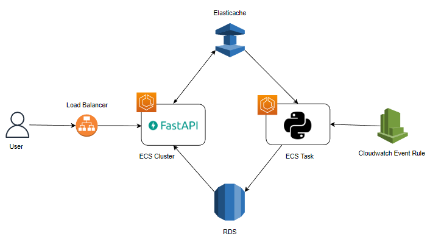

# URL Monitor
URL Monitor is a service that takes a list of URLs (potentially several 1000s) and regularly monitors them. It also exposes a set of endpoints that allows users to view the statistics of the URLs and add new URLs for the service to monitor. 

The service is highly asynchronous. It makes use of async libraries to send queries to the database and make HTTP requests to the aforementioned URLs.
## High Level Design
The service consists of the following components:
* An Application Load Balancer, which users will make requests to the FastAPI app
* ```API Service```: A FastAPI app running on an ECS cluster
* ```Compute Service```: A Python process running in an ECS Task and a Cloudwatch event that triggers the task every 10 minutes
* An Elasticache (Redis)
* A RDS instance (MySQL)
  


Whenever a ```GET``` request is received, FastAPI first checks the cache. If the cache does not contain a result or if the result stored in the cache is older than 10 minutes, it ignores the cache and moves onto querying the database. The cache is subsequently updated with the new data.

### API Endpoints
#### ```GET /urls/top/{status}/{timespan}?cache=true```

#### Path Parameters: 
* ```status```: success/fail
* ```timespan```: hour/week/month
#### Query Parameters:
* ```cache```: true or false. Default: true

Returns the top 10 URLs with the highest count of ```status``` in the past 1 hour, 7 days, or 30 days in descending order. Simply put, it returns the URLs with the highest number of successful or failed requests.

When the query parameter ```cache=false``` is passed, then the cache is reset.

##### Response
```
[
    {
        "name": "a",
        "url": "http://www.a.com"
        "count": 10
    },
    {
        "name": "b",
        "url": "http://www.b.com"
        "count": 4
    },
    ....
]
```
#### ```GET /urls/summary/?cache={value}```
#### Query Parameters:
* ```cache```: true or false. Default: true

Returns the number of successful requests and failed requests made in the past 30 days. 

When the query parameter ```cache=false``` is passed, then the cache is reset.

##### Response
```
[
    {
        "status": "success",
        "count": 2
    },
    {
        "status": "fail",
        "count": 5
    }
]
```
#### ```POST /urls/```
#### JSON Body:
 ```{'name': 'a', 'url': 'http://www.a.com'}```

Adds a new URL to be monitored. The new URL is enqueued in the cache. The compute service then dequeues them regularly and adds it to the list of URLs it would make requests to.

When the query parameter ```cache=false``` is passed, then the cache is reset.

## Run Locally
### Prerequisites
* Python >=3.8.0
* Access to a MySQL Database
* Access to a Redis Cache

### Environment Variables:
Make sure to set the following environment variables
```
DB_USER: database username
DB_PASSWORD: database password 
DB_NAME: database name
DB_PORT: database port
DB_ADDRESS: database address
CACHE_PORT: cache port
CACHE_ADDRESS: cache address
MAX_POOL: max pool of open connections at the same time
MIN_POOL: min pool of connections to open at the same time
TIMEOUT: seconds to wait before timing out when making requests to URLs
```

### Install Dependencies
```
python -m venv .venv
.venv\Script\activate
pip install -r requirements.txt -r requirements-test.txt
```
### Run tests
```
pytest -p no:cacheprovider tests/
```
### Run API
```
uvicorn src.service_monitor.api.app:app --host 0.0.0.0 --port 8000
```
### Run Compute
```
python -m src.service_monitor.compute.scheduler --run-local --data-path data/urls.csv
```
When the flag ```--run-local``` is used, a scheduler is used to run the compute side every 10 minutes. When deployed on AWS, the Cloudwatch event will handle the scheduling of the compute process.


## Deploy
### Prerequisites
* AWS Account
* Github Account
* Two AWS ECR repositories: ```api_repo```, ```compute_repo```

This service is made to be deployed on AWS. It uses Github Actions to automatically run tests, build and push docker images to AWS ECR, and provision infrastructure using Terraform. Follow the steps below to deploy the service:

* Fork this repository
* Setup a Terraform Workspace. To create one, follow these steps: https://learn.hashicorp.com/tutorials/terraform/github-actions. You can stop at step 3 (Set up a GitHub repository). 
* Change the ```workspaces``` and ```organization``` in ```terraform/provider.tf``` with values from the previous step.
* Add the following secrets:
    * ```AWS_REGION```
    * ```AWS_ACCESS_KEY_ID```
    * ```AWS_SECRET_ACCESS_KEY```
    * ```DB_PASSWORD```
    * ```TF_API_TOKEN```
* Change the variables in ```terraform/terraform.tfvars``` to suitable values
* Push to ```main``` to trigger the Github Workflow

## Improvements
This project was created in a very short span of time, so there are a number of ways it can be improved.

* Better comments
* Use timeseries database
* Cleanup job to remove Database entries that are older than a month


